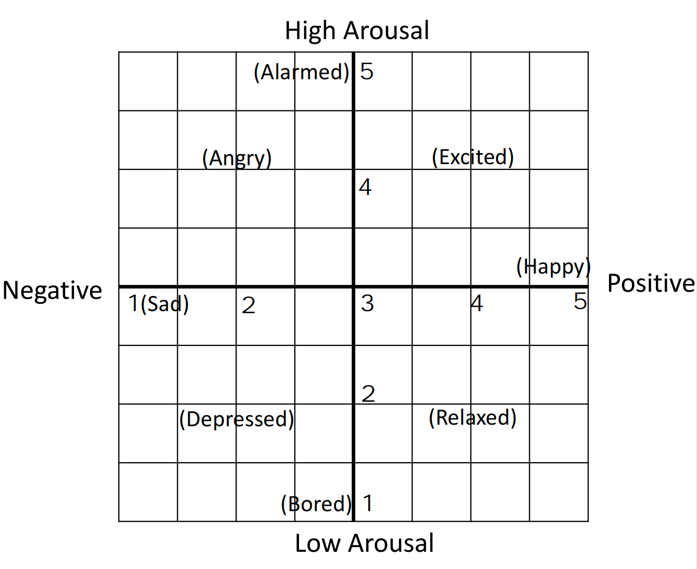

## Instructions for Video Level Self-assessment

Thank you for participating in our study. In this stage, for each short video, you will be rated based on your subjective experience while interacting with it. Please note that your ratings will be used in the study.

The self-assessment includes the following four labels: valence, arousal, immersion, and satisfaction. A 5-point Likert scale was used, ranging from 1 (very low) to 5 (very high). Particularly，valence and arousal are two-dimesions of mood, which come from . 

The following are detailed definitions:

### Valence:

1 - Very negative: You feel very negative mood while interacting with the short video, such as sadness, anger, or disgust. 

2 - Negative: You feel somewhat negative mood while interacting with the short video, but not as strongly as a rating of 1. 

3 - Neutral: You do not feel strongly positive or negative mood while interacting with the short video. 

4 - Positive: You feel somewhat positive mood while interacting with the short video, but not as strongly as a rating of 5. 

5 - Very positive: You feel very positive mood while interacting with the short video, such as happiness, excitement, or joy.

### Arousal: 

1 - Very calm: You feel very calm while interacting with the short video, and your heart rate and breathing are slow and steady. 

2 - Calm: You feel somewhat calm while interacting with the short video, but not as strongly as a rating of 1. 

3 - Neutral: Your heart rate and breathing are slightly elevated, but you do not feel strongly excited or anxious. 

4 - Excited: Your heart rate and breathing are significantly elevated, and you feel excited and stimulated while interacting with the short video. 

5 - Very excited: Your heart rate and breathing are extremely elevated, and you feel highly aroused and stimulated while interacting with the short video.

### Immersion: 

1 - Very disconnected: You feel very disconnected from the video and the events happening on screen. 

2 - Disconnected: You feel somewhat disconnected from the video and the events happening on screen, but not as strongly as a rating of 1. 

3 - Neutral: You feel moderately engaged with the video and the events happening on screen. 

4 - Engaged: You feel highly engaged with the video and the events happening on screen. 

5 - Very engaged: You feel completely immersed in the video and the events happening on screen.

### Satisfaction: 

1 - Very dissatisfied: You feel extremely dissatisfied while interacting with the short video. The content or experience falls far below your expectations or preferences.

2 - Dissatisfied: You feel somewhat dissatisfied while interacting with the short video, but not as strongly as a rating of 1. The content or experience doesn't fully meet your expectations or preferences.

3 - Neutral: You feel neither satisfied nor dissatisfied while interacting with the short video. The content or experience is acceptable but doesn't particularly stand out or leave a strong impression.

4 - Satisfied: You feel somewhat satisfied while interacting with the short video, but not as strongly as a rating of 5. The content or experience meets your expectations and provides a positive experience.

5 - Very satisfied: You feel extremely satisfied while interacting with the short video. The content or experience exceeds your expectations and leaves a highly positive impression.

